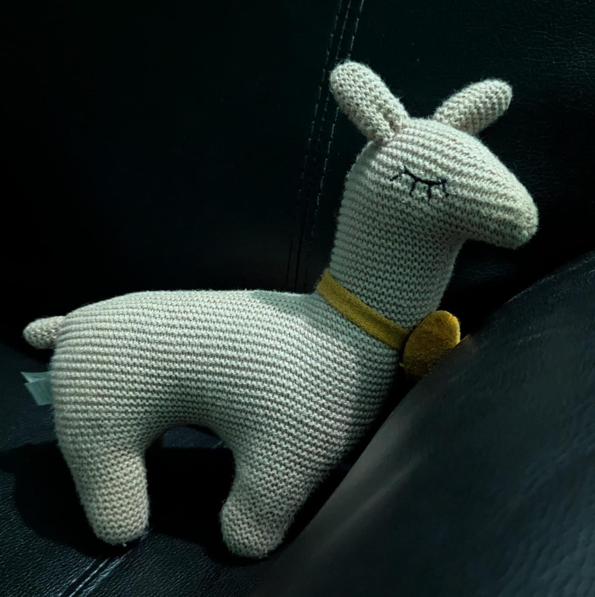

# Golean

Golean, a repo that allows you to go lean when you are setting up a new Go project. This comprises of so many utilities one would need, added in separate packages which can be added whenever needed.

## Sub-modules

- [gosafe](./gosafe/)

## Inspiration for the name

This is Joelene. I originally wanted an Alpaca named Joelene, and my friend got me this. She is an Llama.
